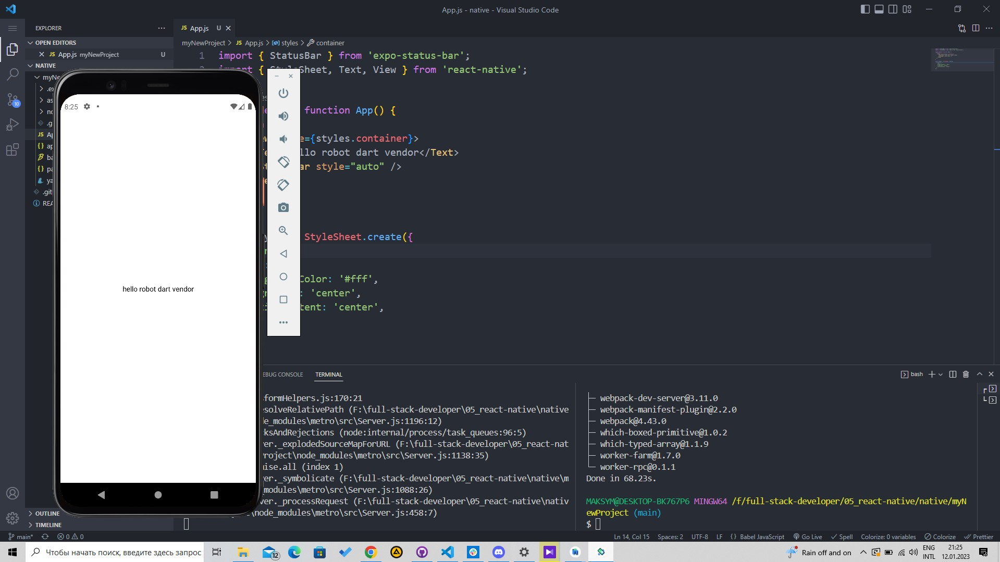

# native
# Установить expo
# Установить Android Studio
# Установить Xcode (если работаете на Mac) => мака не має 
# Инициализировать проект при помощи expo (Вибираем шаблон проекта blank)
# Запустить проект
# Настроить Android Studio
# Настроить Xcode (если работаете на Mac)
# Установить expo client себе на телефон
# Запустить созданый проект на телефоне, эмуляторе Android, симуляторе iOS (если работаете на Mac)

ALL DONE
